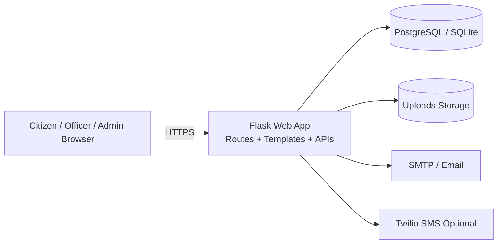
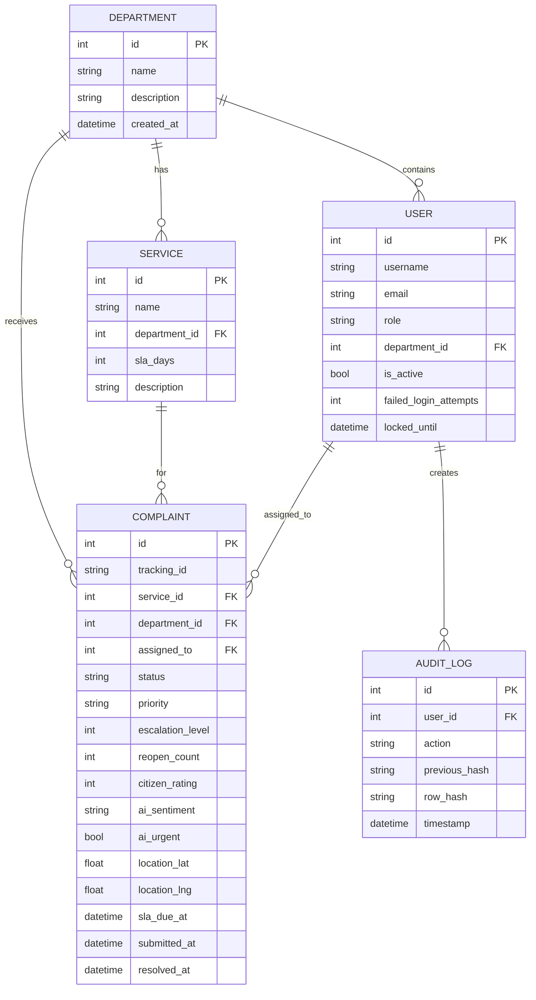
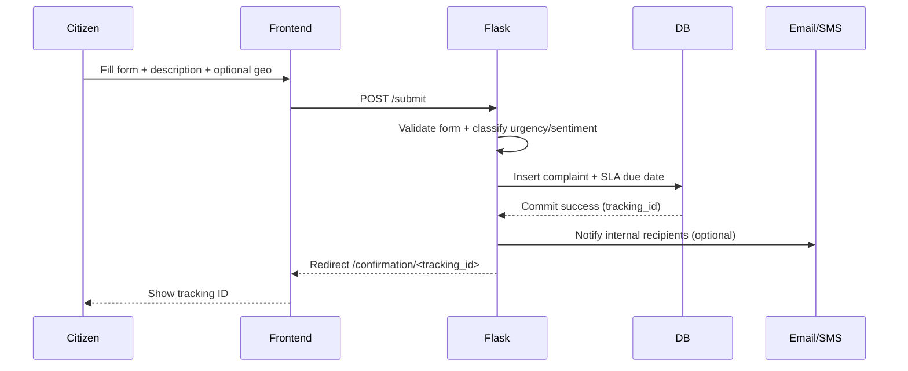
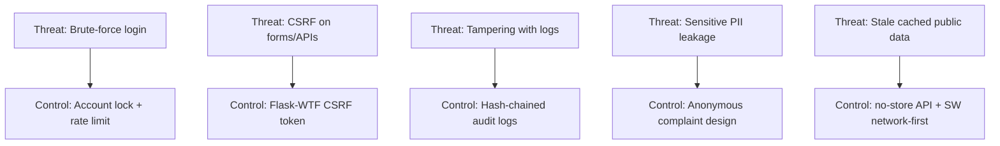

# MIBSP Project Diagrams (Viva Ready)

## 1. 3-Tier Architecture



## 2. ER Diagram (Core Entities)



## 3. Sequence Diagram (Complaint Submission Flow)



## 4. Threat Model (High-Level)



## 5. Deployment Architecture (Render)

```mermaid
flowchart LR
    GH[GitHub Repository] -->|Auto deploy on main| R[Render Web Service]
    R --> APP[Gunicorn + Flask App]
    APP --> DB[(Render PostgreSQL)]
    APP --> FS[/tmp uploads disk]
    APP --> SMTP[SMTP Server]
    APP --> TW[Twilio Optional]
    LB[Render Edge / HTTPS] --> APP
```

